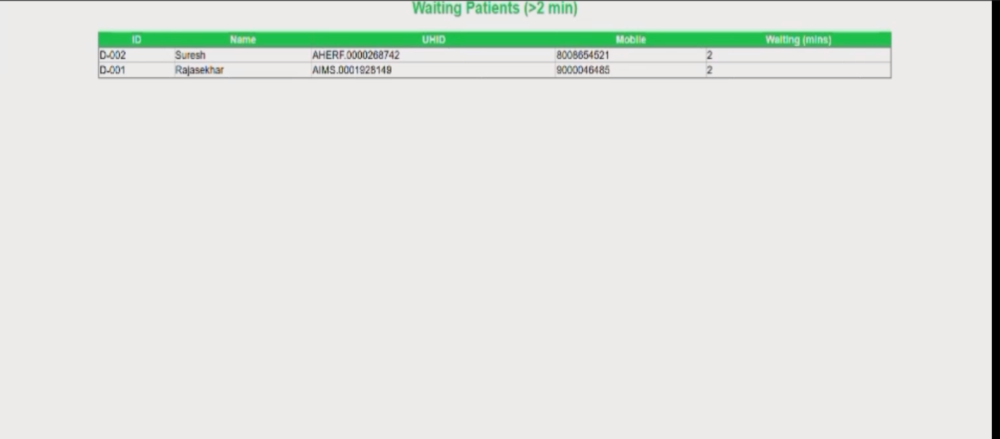

# 👤 Apollo Patient Kiosk: Face Recognition + Wait Time Dashboard

A real-time face recognition system for hospital patient check-in/check-out, with live dashboard showing waiting times.

---

## 🎯 Purpose

- Automate patient identification using face scan → fetch UHID, Name, Mobile  
- Track check-in/check-out times → calculate wait duration  
- Display live dashboard of patients waiting >2 mins  
- Auto-remove patient from dashboard when they leave camera view  
- Built for Apollo Hospitals (simulated environment)
- [Click Here 👇]  

---

## 🖼️ Screenshots

### 1. Face Scan + Patient Info Display

  
*System recognizes patient → displays UHID, Name, Mobile*

### 2. Multi-Person Detection + Wait Time Tracking

  
*Detects multiple patients → assigns ID, tracks time since check-in*

### 3. Patient Leaves → Auto-Removed from Dashboard

  
*When patient moves out of frame → removed from dashboard*

### 4. Live Waiting Patients Dashboard

  
*Shows patients waiting >2 mins → helps staff prioritize*

---

## 🎥 Watch the Demo

▶️ [Watch Full Demo on YouTube](https://youtu.be/your-video-id-here)

*(Click to see real-time face detection, check-in tracking, auto-remove, and live dashboard updates)*

---

## 🛠️ Tech Stack

- Python
- OpenCV (for face detection)
- Flask (for web interface)
- SQLite / PostgreSQL (for storing patient data)
- HTML/CSS (for dashboard styling)

---

## 💡 Key Feature Highlights

> ✅ **Real-Time Face Recognition**: Scans faces → matches with database → displays patient details instantly  
> ✅ **Wait Time Tracker**: Starts timer when patient enters frame → stops when they leave  
> ✅ **Auto-Remove Logic**: If patient is not seen for 10 seconds → removed from dashboard  
> ✅ **Live Dashboard**: Shows only patients waiting >2 minutes → auto-refreshes every 5 seconds  
> ✅ **Stable Display**: Even if face is briefly missed → details stay visible for 3 seconds

